# Diagrama de Arquitectura - UNQlassroom

## User Story: "Crear Asignación"

> **US:** *"Como docente, quiero crear una nueva asignación para el curso y definir si su resolución será de carácter individual o grupal, para estructurar correctamente la modalidad de evaluación y crear los repositorios adecuados."*

---

## Vista del Docente 

## Diagrama 

```mermaid
flowchart LR
%% Estilos para diferenciar componentes Propios y de Terceros
    classDef propio fill:#e1f5fe,stroke:#0288d1,stroke-width:2px,color:#01579b
    classDef tercero fill:#f5f5f5,stroke:#757575,stroke-width:1.5px,stroke-dasharray: 4 2,color:#333333

%% 1. NODO CLIENTE
    subgraph CLIENTE["Frontend (como docente)"]
        UI["CrearAsignacionModal.tsx<br/><b>(Componente de Asignación)</b>"]:::propio
        SVC_FE["asignacionService.ts<br/><b>(Servicio)</b>"]:::propio
        AXIOS["Axios<br/><b>(Cliente HTTP)</b>"]:::tercero
    end

%% 2. NODO BACKEND
    subgraph BACKEND["Backend"]
        SEC["JwtAuthenticationFilter.kt<br/><b>(Seguridad)</b>"]:::propio
        CTRL["AsignacionController.kt<br/><b>(REST Controller)</b>"]:::propio
        SVC_BE["AsignacionServiceImpl.kt<br/><b>(Servicio)</b>"]:::propio
        DOM["Asignacion.kt<br/><b>(Modelo)</b>"]:::propio
        INT["GitHubRepoService.kt<br/><b>(Integración con GitHub)</b>"]:::propio
        REPO["AsignacionRepository.kt<br/><b>(Persistencia)</b>"]:::propio

    end

%% 3. NODO BASE DE DATOS
    subgraph DB["Base de Datos"]
        PG[("PostgreSQL 15")]:::tercero
    end

%% 4. NODO EXTERNO GITHUB
    subgraph GH["Servicio externo (GitHub)"]
        GH_API["GitHub REST API"]:::tercero
    end

%% Flujo secuencial
    UI --> SVC_FE
    SVC_FE --> AXIOS
    AXIOS -- "POST /cursos/{id}/asignaciones<br/>(Bearer JWT)" --> SEC

    SEC --> CTRL
    CTRL --> SVC_BE
    SVC_BE --> DOM
    SVC_BE --> INT
    SVC_BE --> REPO

    INT -- "Se envía la petición HTTP para crear los repositorios de la asignación en GitHub" --> GH_API
    REPO -- "Se persiste la asignación" --> PG
```

> **Referencias visuales del diagrama:**
> * **Recuadros azules con borde sólido (`color azul`):** Componentes propios desarrollados para la aplicación.
> * **Recuadros grises con borde punteado (`color gris`):** Componentes, librerías y servicios de terceros.

---

## Responsanilidades

### Frontend
* **`CrearAsignacionModal.tsx` (Componente de Asignación):** Componente interactivo que renderiza el formulario de alta de asignación, valida los campos ingresados (título, descripción, fecha límite, template) y permite configurar la modalidad individual o grupal.
* **`asignacionService.ts` (Servicio):** Módulo que centraliza la llamada hacia el backend mediante la función `crearAsignacion`.
* **`Axios` (Librería HTTP):** Cliente HTTP que serializa la petición JSON, inyecta el token Bearer desde el almacenamiento local y despacha la solicitud por la red.

---

### Backend
* **`JwtAuthenticationFilter.kt` (Seguridad):** Filtro que intercepta la petición HTTP, extrae el token Bearer del encabezado `Authorization`, valida su autenticidad y establece la identidad del docente en el contexto de seguridad de Spring.
* **`AsignacionController.kt` (Controlador REST):** Expone el endpoint `POST /cursos/{cursoId}/asignaciones`, valida el DTO entrante (`CrearAsignacionRequestDTO`) y delega la ejecución al servicio de asignaciones.
* **`AsignacionServiceImpl.kt` (Servicio):** Componente transaccional (`@Transactional`) que verifica los permisos del docente, valida el template, coordina la generación de repositorios y colaboradores en GitHub, construye las entidades y persiste la asignación.
* **`Asignacion.kt` (Modelo):** Entidad de negocio que encapsula los datos de la asignación y métodos propios como `generarNombreRepo` y `generarDescripcionRepo`, garantizando la convención de nombres y slugs para los repositorios de los estudiantes.
* **`GitHubRepoService.kt` (Integración con GitHub):** Servicio adaptador que interactúa con la API de GitHub para verificar la existencia del template y generar los nuevos repositorios privados a partir de la plantilla elegida.
* **`AsignacionRepository.kt` (Persistencia):** Interfaz que extiende `JpaRepository<Asignacion, Long>`, proveyendo las operaciones CRUD para almacenar la asignación y sus relaciones en la base de datos.

---

### Base de Datos
* **`PostgreSQL 15`:** Motor de base de datos relacional donde se almacenan las tablas de la aplicación.

---

### Servicio Externo de GitHub
* **`GitHub REST API`:** Servicio externo de GitHub que recibe las llamadas HTTPS autenticadas mediante GitHub App para aprovisionar los repositorios e invitar a los alumnos como colaboradores.
